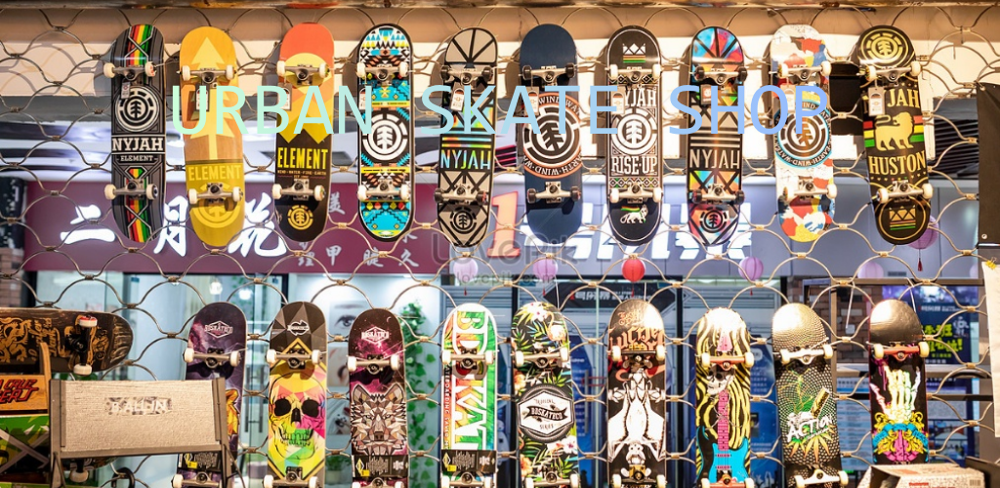
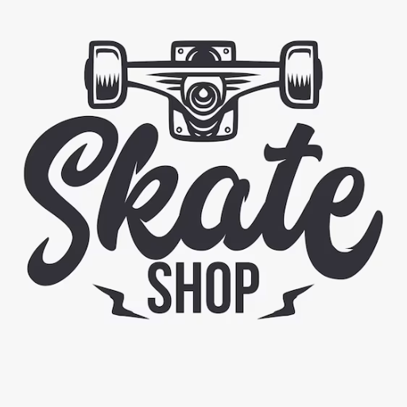

# 🛹 Urban Skate Shop - Aplicación Nativa Android
**Autor:** David SV  
**Curso:** Desarrollo de Aplicaciones Multiplataforma (UT6 y UT7)

---

## 1. Introducción 🚀 (RA4.ce1)
En este proyecto he transformado mi aplicación web de Angular en una **App Nativa para Android** utilizando **Capacitor**. El objetivo principal ha sido la integración de hardware real (Cámara y GPS) y la mejora de la experiencia de usuario en dispositivos móviles.

## 2. Configuración del Entorno y Permisos ✅ (RA4.ce1)
Para profesionalizar el despliegue, realicé los siguientes ajustes técnicos:

* **Identidad de la App:** Modifiqué `capacitor.config.ts` estableciendo el ID `com.sanchez.urbanskate` y el nombre "Urban Skate Shop".
* **Permisos Nativos:** Configuré el archivo `AndroidManifest.xml` para solicitar acceso a los sensores necesarios:
  * `CAMERA`: Para la gestión de fotos de perfil.
  * `ACCESS_FINE_LOCATION`: Para la ubicación precisa del punto de entrega.
  * `VIBRATE`: Para el feedback háptico.

### Captura de Configuración (Permisos XML):
> 

---

## 3. Implementación de Plugins e Integración (RA4.ce2) 🛠️
He implementado las funciones base y **dos mejoras de hardware adicionales**:

1. **Cámara:** El usuario captura su foto para el avatar en "Cuenta".
2. **GPS:** En el "Carrito", se obtienen coordenadas reales para el envío.
3. **Haptics (Extra):** Vibración al añadir productos y confirmar pedidos.
4. **Share (Extra):** Botón nativo para compartir la URL de la tienda.

---

## 4. Resolución de Problemas (Troubleshooting) (RA4.ce4) 🛑
* **🛑 Problema:** Error de conexión (Pantalla blanca) en emulador.
* **🔍 Causa:** Bloqueo de tráfico HTTP "Cleartext".
* **✅ Solución:** Inserción de `android:usesCleartextTraffic="true"` en el Manifest.

---

## 5. Informe de Usabilidad (RA2.ce5) 📱
* **Ergonomía:** Botón de GPS tipo `block` para fácil acceso táctil.
* **Visibilidad:** Contraste alto con `Ion-Badge` rojos sobre fondo azul.
* **Navegación:** Integración total con el botón físico "Atrás" de Android.

---

## 6. Evidencias del Despliegue 📸 (RA4.ce3)
La aplicación es totalmente funcional y fluida en entorno nativo.

| Perfil con Cámara | Carrito con GPS | Interfaz Principal |
| :---: | :---: | :---: |
|  |  |  |

---

## 7. Despliegue, Marketing y Lanzamiento (UT7 Completa) 🚀

### 🎨 7.1 Imagen de Marca: Iconografía y Splash Screen
He personalizado la identidad visual de la App para una carga inmersiva:
* **Icono:** Logo vintage adaptativo generado para todas las densidades.
* **Splash Screen:** Imagen real de la tienda (expositor de tablas).

| Icono de la App | Pantalla de Carga (Splash) |
| :---: | :---: |
|  |  |

### 📦 7.2 & 7.3 Compilación y Firma (AAB)
* **Formato AAB:** Android App Bundle generado para optimizar el peso en la descarga.
* **Firma Digital:** Certificado digital `david-skate.keystore` con alias `urban-skate-alias`.

| Firma Keystore | Bundle Generado (.aab) |
| :---: | :---: |
|  |  |

### 🖼️ 7.4 Ficha de la Tienda y Press Kit (ASO)
He preparado el material gráfico obligatorio para la Google Play Console en la carpeta `/docs/store`:

* **Feature Graphic:** Banner publicitario diseñado con la foto de la tienda y el logo corporativo.
* **Keywords:** Skate Shop, Tablas Online, Envío GPS, David SV.

| Banner Publicitario (1024x500) | Icono Tienda (512x512) |
| :---: | :---: |
|  |  |

### 📈 7.5 Estrategia de Marketing y ASO (RA5.ce5)
He diseñado un plan de lanzamiento para maximizar las descargas de **Urban Skate Shop**:

* **Optimización ASO:** Selección de keywords estratégicas y redacción de ficha persuasiva.
* **Canales Sociales:** Estrategia focalizada en Instagram y TikTok para atraer tráfico.
* **Material Gráfico:** Diseño de piezas promocionales de alta calidad siguiendo la estética "grange" de la cultura skate, disponibles en la carpeta `/docs/store`.

| Banner Publicitario (1024x500) | Post Promocional Redes (1080x1080) |
| :---: | :---: |
|  |  |

### 7.6 Mantenimiento y Ciclo de Vida 🔄
Plan de futuro: Actualización de `versionCode` mensual y revisión de compatibilidad con Android 15+.

---
**Estado Final:** Proyecto completado, firmado y listo para producción.

---
## 🏁 7.7 Reto Final: Ready to Launch
He completado el rol de **Release Manager** preparando el lanzamiento oficial de la aplicación:
* **Ejecutable:** Generación del archivo `app-release.aab` firmado y optimizado.
* **Store Assets:** Creación de un "Press Kit" completo en `/docs/store` que incluye Ficha ASO, Banner promocional y Gráficos de marketing de alta fidelidad.
* **Seguridad:** Configuración de `.gitignore` para proteger la Keystore privada, siguiendo las mejores prácticas de seguridad en el desarrollo móvil.
