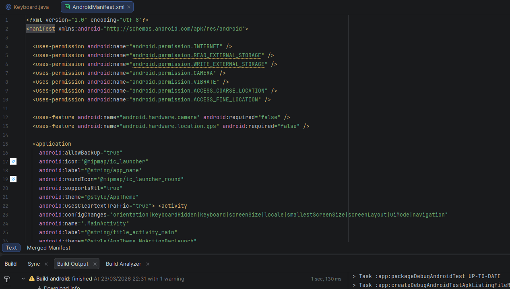
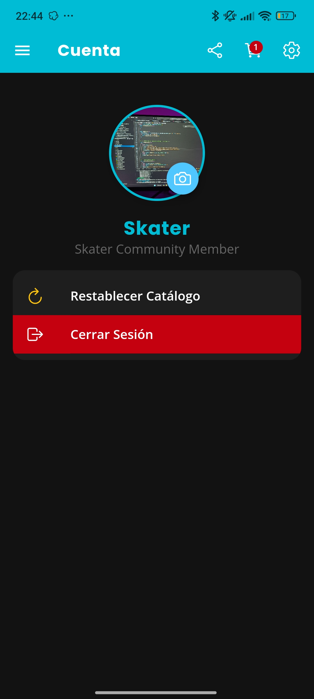
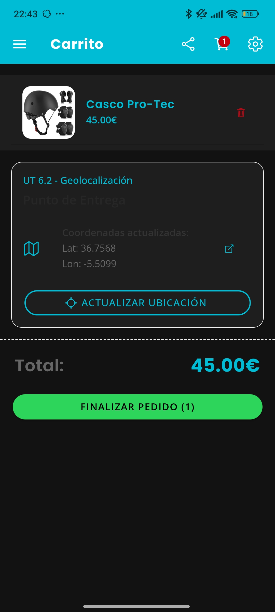
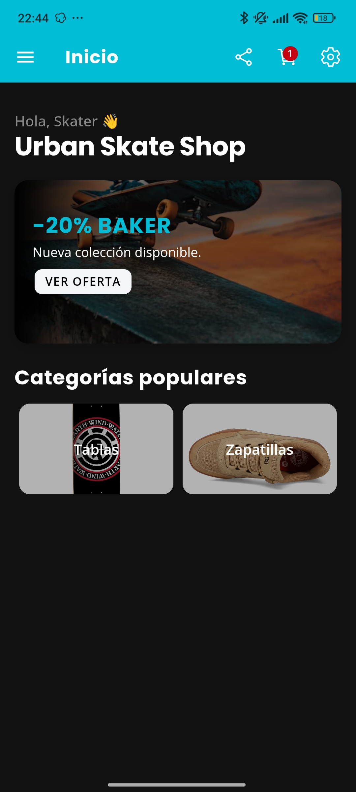
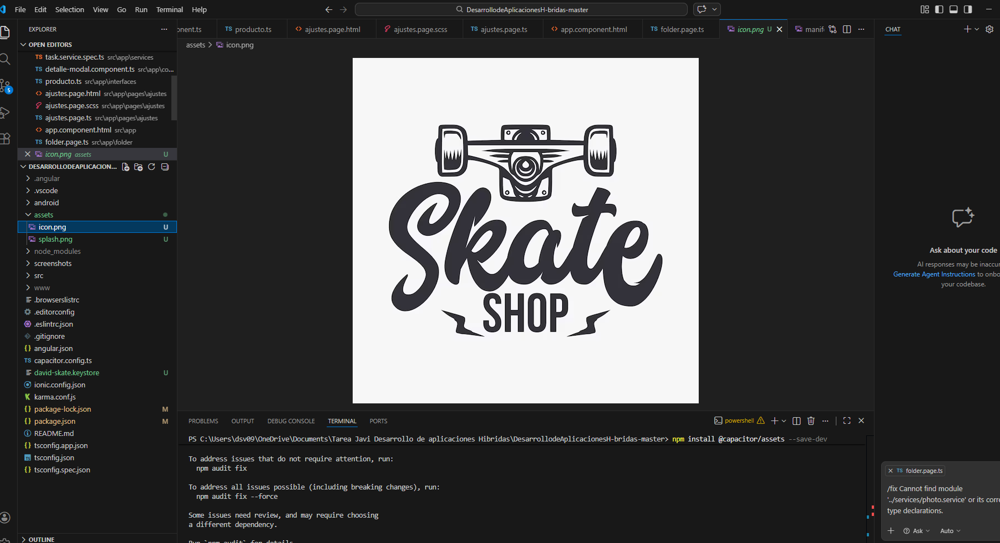
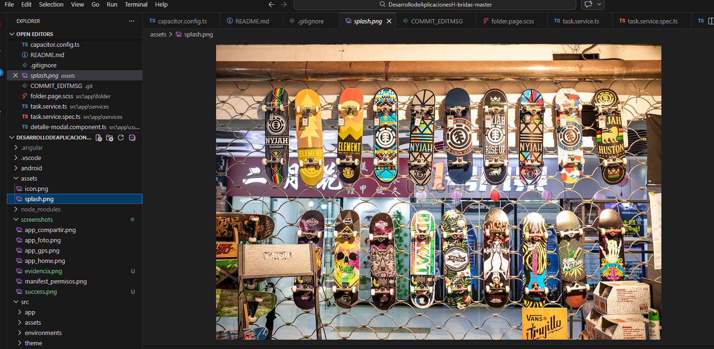
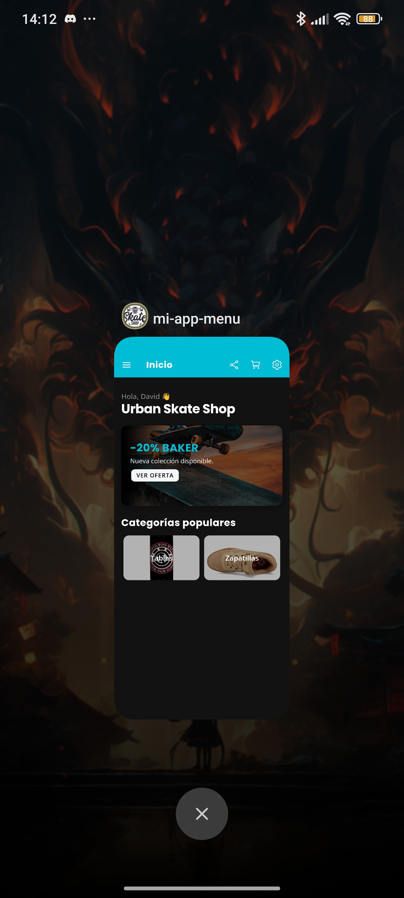
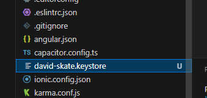
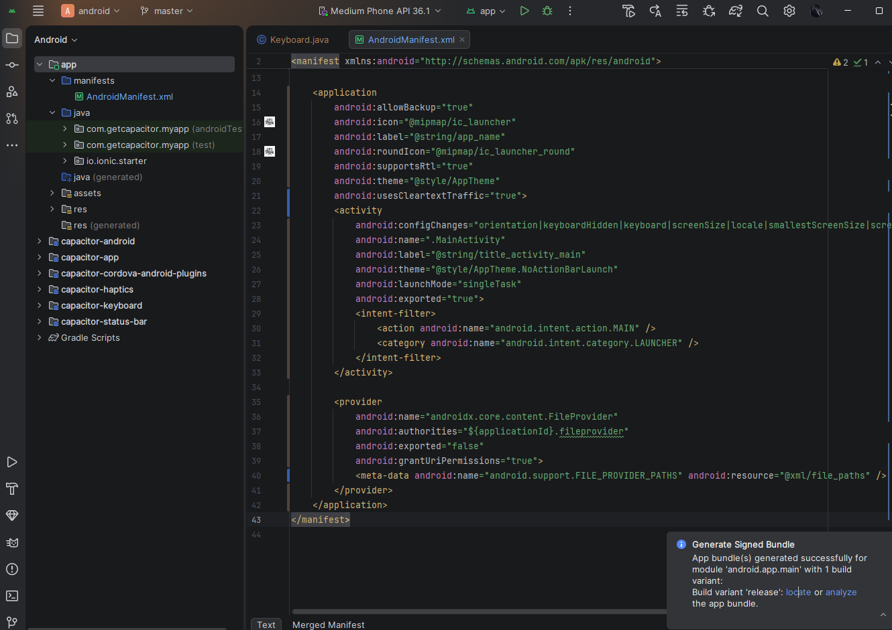

# 🛹 Urban Skate Shop - Aplicación Nativa Android
**Autor:** David SV  
**Curso:** Desarrollo de Aplicaciones Multiplataforma (UT6 y UT7)

---

## 1. Introducción 🚀 (RA4.ce1)
En este proyecto he transformado mi aplicación web de Angular en una **App Nativa para Android** utilizando **Capacitor**. El objetivo principal ha sido la integración de hardware real (Cámara y GPS) y la mejora de la experiencia de usuario en dispositivos móviles.

## 2. Configuración del Entorno y Permisos ✅ (RA4.ce1)
Para profesionalizar el despliegue, realicé los siguientes ajustes técnicos:

* **Identidad de la App:** Modifiqué `capacitor.config.ts` estableciendo el ID `com.sanchez.urbanskate` y el nombre "Urban Skate Shop".
* **Permisos Nativos:** Configuré el archivo `AndroidManifest.xml` para solicitar acceso a los sensores necesarios:
  * `CAMERA`: Para la gestión de fotos de perfil.
  * `ACCESS_FINE_LOCATION`: Para la ubicación precisa del punto de entrega.
  * `VIBRATE`: Para el feedback háptico.

### Captura de Configuración (Permisos XML):
> 

---

## 3. Implementación de Plugins e Integración (RA4.ce2) 🛠️
He implementado las funciones base y **dos mejoras de hardware adicionales**:

1. **Cámara:** El usuario captura su foto para el avatar en "Cuenta".
2. **GPS:** En el "Carrito", se obtienen coordenadas reales para el envío.
3. **Haptics (Extra):** Vibración al añadir productos y confirmar pedidos.
4. **Share (Extra):** Botón nativo para compartir la URL de la tienda.

---

## 4. Resolución de Problemas (Troubleshooting) (RA4.ce4) 🛑
* **🛑 Problema:** Error de conexión (Pantalla blanca) en emulador.
* **🔍 Causa:** Bloqueo de tráfico HTTP "Cleartext".
* **✅ Solución:** Inserción de `android:usesCleartextTraffic="true"` en el Manifest.

---

## 5. Informe de Usabilidad (RA2.ce5) 📱
* **Ergonomía:** Botón de GPS tipo `block` para fácil acceso táctil.
* **Visibilidad:** Contraste alto con `Ion-Badge` rojos sobre fondo azul.
* **Navegación:** Integración total con el botón físico "Atrás" de Android.

---

## 6. Evidencias del Despliegue 📸 (RA4.ce3)
La aplicación es totalmente funcional y fluida en entorno nativo.

| Perfil con Cámara | Carrito con GPS | Interfaz Principal |
| :---: | :---: | :---: |
|  |  |  |

---

## 7. Despliegue, Marketing y Lanzamiento (UT7 Completa) 🚀

### 🎨 7.1 Imagen de Marca: Iconografía y Splash Screen
He personalizado la identidad visual sustituyendo los recursos por defecto:
* **Icono:** Logo vintage adaptativo generado para todas las densidades de pantalla.
* **Splash Screen:** Imagen real de la tienda (expositor de tablas) para una carga inmersiva.
* **Herramienta:** Uso de `@capacitor/assets` para la generación automática.

| Icono de la App | Pantalla de Carga (Splash) |
| :---: | :---: |
|  |  | 
|  |

### 📦 7.2 & 7.3 Compilación y Firma (AAB)
He generado el ejecutable final bajo los estándares de Google Play Store:
* **Formato AAB:** Generación de un *Android App Bundle* para optimizar el peso de la descarga.
* **Firma Digital:** Creación de un almacén de claves seguro (`david-skate.keystore`) y alias `urban-skate-alias`.
* **Modo Release:** Compilación optimizada mediante `ionic build --prod`.

| Firma Keystore | Bundle Generado (.aab) |
| :---: | :---: |
|  |  |

### 7.4 & 7.5 Ficha de la Tienda y ASO 📈
Estrategia de posicionamiento diseñada:
- **ASO:** Keywords clave como "Skate Shop", "Tablas de Skate", "Tienda Urbana".
- **Descripción:** "La tienda definitiva para skaters. Compra marcas como Baker o Element con precisión de envío por GPS".
- **Categoría:** Compras / Deportes.

### 7.6 Mantenimiento y Ciclo de Vida 🔄
Plan de futuro para la aplicación:
1. **Actualizaciones:** Incremento de `versionCode` en cada nuevo despliegue.
2. **Seguridad:** Revisión trimestral de permisos de Cámara y GPS.
3. **Mantenimiento:** Actualización de plugins de Capacitor para compatibilidad con Android 15+.

---
**Estado Final:** Aplicación empaquetada, firmada y lista para producción.
